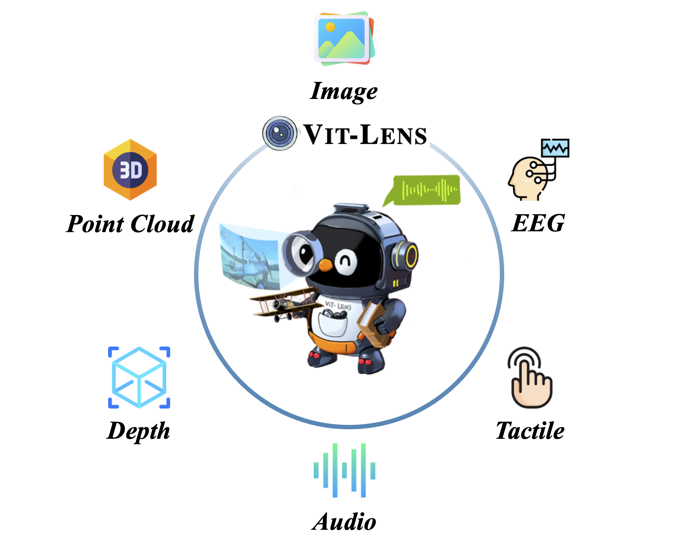

# ViT-Lens

[](https://ailab-cvc.github.io/seed/vitlens/)
[](https://arxiv.org/abs/2311.16081)
[](https://arxiv.org/abs/2308.10185)
[](https://huggingface.co/TencentARC/ViT-Lens/tree/main)

*TL;DR*: We present ViT-Lens, an approach for advancing omni-modal representation learning by leveraging a pretrained-ViT with modality Lens to comprehend diverse modalities.
<p align="center">
    
</p>
<p align="center">
    
</p>

### 📢 News
<!--  -->
- [2023.12.13] We release training code and models of ViT-Lens.
- [2023.11.28] We upgrade ViT-Lens, with added modalities and applications. Stay tuned for the release of code and models [[`arXiv paper`](https://arxiv.org/abs/2311.16081)].
- [2023.08.22] We release the arXiv paper, inference codes and checkpoints for 3D [[`arXiv paper`](https://arxiv.org/abs/2308.10185)]. 

### 📝 Todo
- [x] Models for more modalities.
- [ ] Code for ViT-Lens integration with InstructBLIP and SEED.
- [ ] Online demo for ViT-Lens integration with InstructBLIP and SEED.

## 🔨 Installation
```shell
conda create -n vit-lens python=3.8.8 -y
conda activate vit-lens

# Install pytorch>=1.9.0 
conda install pytorch==1.11.0 torchvision==0.12.0 torchaudio==0.11.0 cudatoolkit=11.3 -c pytorch -y

# Install ViT-Lens
git clone https://github.com/TencentARC/ViT-Lens.git
cd ViT-Lens/
pip install -e vitlens/
pip install -r vitlens/requirements-training.txt
```
<details>
  <summary>Training/Inference on OpenShape Triplets on 3D point clouds: environment setup (click to expand)</summary>

```shell
conda create -n vit-lens python=3.8.8 -y
conda activate vit-lens
conda install pytorch==1.12.1 torchvision==0.13.1 torchaudio==0.12.1 cudatoolkit=11.3 -c pytorch -y
conda install -c dglteam/label/cu113 dgl -y

# Install ViT-Lens
git clone https://github.com/TencentARC/ViT-Lens.git
cd ViT-Lens/
pip install -e vitlens/
pip install -r vitlens/requirements-training.txt
```
</details>

## 🔍 ViT-Lens Model
|                 |   MN40   |  SUN.D   |  NYU.D   | Audioset | VGGSound |  ESC50   |    Clotho    |   AudioCaps   |  TAG.M   |  IN.EEG  |                           Download                           |
| --------------- | :------: | :------: | :------: | :------: | :------: | :------: | :----------: | :-----------: | :------: | :------: | :----------------------------------------------------------: |
| ImageBind(Huge) |    -     |   35.1   |   54.0   |   17.6   |   27.8   |   66.9   |   6.0/28.4   |   9.3/42.3    |    -     |    -     |                              -                               |
| ViT-Lens        | **80.6** | **52.2** | **68.5** | **26.7** | **31.7** | **75.9** | **8.1/31.2** | **14.4/54.9** | **65.8** | **42.7** | [vitlensL](https://huggingface.co/TencentARC/ViT-Lens/blob/main/vitlensL.pt) |

We release a one-stop `ViT-Lens-L` model and show its performance on ModelNet40 (MN40, top1 accuracy), SUN RGBD Depth-only (SUN.D, top1 accuracy), NYUv2 Depth-only (NYU.D, top1 accuracy), Audioset (Audioset, mAP), VGGSound (VGGSound, top1 accuracy), ESC50 (ESC50, top1 accuracy), Clotho (Clotho, R@1/R@10), AudioCaps (AudioCaps, R@1/R@10), TAG.M (Touch-and-Go Material, top1 accuracy) and IN.EEG (ImageNet EEG, top1 accuracy). ViT-Lens consistently outperforms ImageBind.

For more model checkpoints (trained on different data or with better performance), please refer to [MODEL_ZOO.md](MODEL_ZOO.md).


## 📚 Usage
- You may set your paths for you own project in [constants.py](vitlens/src/open_clip/constants.py).
- We provide an API ([source file](vitlens/src/mm_vit_lens/vitlens.py)) and provide an example ([here](example.py)) for reference. You can use ViT-Lens to extract and compare features across modalities:
  ```python
  import os
  import torch

  from open_clip import ModalityType
  from mm_vit_lens import ViTLens

  here = os.path.abspath(os.path.dirname(__file__))

  model = ViTLens(modality_loaded=[ModalityType.IMAGE, ModalityType.AUDIO, ModalityType.TEXT, ModalityType.PC])

  device = "cuda:0" if torch.cuda.is_available() else "cpu"
  model = model.to(device)

  # Example 1
  images = [
      os.path.join(here, "assets/example/image_bird.jpg"),
      os.path.join(here, "assets/example/image_fire.jpg"),
      os.path.join(here, "assets/example/image_dog.jpg"),
      os.path.join(here, "assets/example/image_beach.jpg"),
  ]
  audios = [
      os.path.join(here, "assets/example/audio_chirping_birds.flac"),
      os.path.join(here, "assets/example/audio_crackling_fire.flac"),
      os.path.join(here, "assets/example/audio_dog.flac"),
      os.path.join(here, "assets/example/audio_sea_wave.flac"),
  ]
  texts = [
      "a bird",
      "crackling fire",
      "a dog",
      "sea wave",
  ]
  inputs_1 = {
      ModalityType.IMAGE: images,
      ModalityType.AUDIO: audios,
      ModalityType.TEXT: texts,
  }

  with torch.no_grad(), torch.cuda.amp.autocast():
      outputs_1 = model.encode(inputs_1, normalize=True)

  sim_at = torch.softmax(100 * outputs_1[ModalityType.AUDIO] @ outputs_1[ModalityType.TEXT].T, dim=-1)
  print(
      "Audio x Text:\n",
      sim_at
  )
  # Expected output
  # Audio x Text:
  #  tensor([[9.9998e-01, 9.3977e-07, 2.1545e-05, 9.3642e-08],
  #         [3.8017e-09, 1.0000e+00, 3.1551e-09, 6.9498e-10],
  #         [9.4895e-03, 1.3270e-06, 9.9051e-01, 2.5545e-07],
  #         [9.7020e-06, 6.4767e-07, 2.8860e-06, 9.9999e-01]], device='cuda:0')

  sim_ai = torch.softmax(100 * outputs_1[ModalityType.AUDIO] @ outputs_1[ModalityType.IMAGE].T, dim=-1)
  print(
      "Audio x Image:\n",
      sim_ai
  )
  # Expected output
  # Audio x Image:
  #  tensor([[1.0000e+00, 1.5798e-06, 2.0614e-06, 1.6502e-07],
  #         [2.3712e-09, 1.0000e+00, 1.4446e-10, 1.2260e-10],
  #         [4.9333e-03, 1.2942e-02, 9.8212e-01, 1.8582e-06],
  #         [6.8347e-04, 1.0547e-02, 1.3476e-05, 9.8876e-01]], device='cuda:0')


  # Example 2
  pcs = [
      os.path.join(here, "assets/example/pc_car_0260.npy"),
      os.path.join(here, "assets/example/pc_guitar_0243.npy"),
      os.path.join(here, "assets/example/pc_monitor_0503.npy"),
      os.path.join(here, "assets/example/pc_person_0102.npy"),
      os.path.join(here, "assets/example/pc_piano_0286.npy"),
  ]
  text_pcs = ["a car", "a guitar", "a monitor", "a person", "a piano"]
  inputs_2 = {
      ModalityType.PC: pcs,
      ModalityType.TEXT: text_pcs,
  }
  with torch.no_grad(), torch.cuda.amp.autocast():
      outputs_2 = model.encode(inputs_2, normalize=True)
  sim_pc_t = torch.softmax(100 * outputs_2[ModalityType.PC] @ outputs_2[ModalityType.TEXT].T, dim=-1)
  print(
      "PointCould x Text:\n",
      sim_pc_t
  )
  # Expected output:
  # PointCould x Text:
  #  tensor([[9.9945e-01, 1.0483e-05, 1.4904e-04, 2.3988e-05, 3.7041e-04],
  #         [1.2574e-09, 1.0000e+00, 6.8450e-09, 2.6463e-08, 3.3659e-07],
  #         [6.2730e-09, 1.9918e-06, 9.9999e-01, 6.7161e-06, 4.9279e-06],
  #         [1.8846e-06, 7.4831e-06, 4.4594e-06, 9.9998e-01, 7.9092e-06],
  #         [1.2218e-08, 1.5571e-06, 1.8991e-07, 1.7521e-08, 1.0000e+00]],
  #        device='cuda:0')

  ```


## 📦 Datasets
Please refer to [DATASETS.md](DATASETS.md) for dataset preparation. 

## 🚀 Training & Inference
Please refer to [TRAIN_INFERENCE.md](TRAIN_INFERENCE.md) for details.

## 🧩 Model Zoo
Please refer to [MODEL_ZOO.md](MODEL_ZOO.md) for details.


## 👀 Visualization of Demo
<details open><summary>[ Plug ViT-Lens into SEED: enabling compound Any-to-Image Generation ]</summary>
</details>

<details close><summary>[ Plug ViT-Lens into InstructBLIP: enabling Any instruction following ]</summary>
</details>

<details open><summary>[ Plug ViT-Lens into InstructBLIP: enabling Any instruction following ]</summary>
</details>

<details close><summary>[ Example: Plug 3D lens to LLM ]</summary>
</details>

<details close><summary>[ Example: Plug 3D lens to LLM ]</summary>
</details>


## 🎓 Citation
If you find our work helps, please give us a star🌟 and consider citing:
```bib
@article{lei2023vitlens,
  title={Vit-lens: Towards omni-modal representations},
  author={Lei, Weixian and Ge, Yixiao and Zhang, Jianfeng and Sun, Dylan and Yi, Kun and Shan, Ying and Shou, Mike Zheng},
  journal={arXiv preprint arXiv:2308.10185},
  year={2023}
}
```
```bib
@article{lei2023vitlens-2,
  title={ViT-Lens-2: Gateway to Omni-modal Intelligence},
  author={Lei, Weixian and Ge, Yixiao and Yi, Kun and Zhang, Jianfeng and Gao, Difei and Sun, Dylan and Ge, Yuying and Shan, Ying and Shou, Mike Zheng},
  journal={arXiv preprint arXiv:2311.16081},
  year={2023}
}
```


## ✉️ Contact
Questions and discussions are welcome via leiwx52@gmail.com or open an issue.


## 🙏 Acknowledgement
This codebase is based on [open_clip](https://github.com/mlfoundations/open_clip), [ULIP](https://github.com/salesforce/ULIP), [OpenShape](https://github.com/Colin97/OpenShape_code) and [LAVIS](https://github.com/salesforce/LAVIS). Big thanks to the authors for their awesome contributions!
