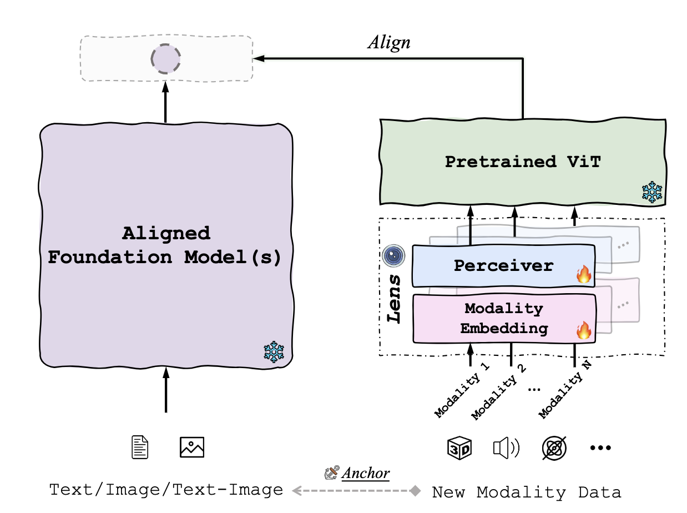

#  ViT-Lens
*TL;DR*: We present ViT-Lens, an approach for advancing omni-modal representation learning by leveraging a pretrained-ViT to comprehend diverse modalities with modality lens.
<p align="center">
    
</p>

### 📢 News
<!--  -->
- [2023.08.22] We release the arXiv paper, inference codes and checkpoints for 3D.

### 📝 Todo
- [ ] Models for more modalities.
- [ ] InstructBLIP w/ ViT-Lens for 3D / 3D+images.

## 🔨 Installation
```shell
git clone https://github.com/TencentARC/ViT-Lens.git
cd ViT-Lens

conda create -n vit-lens python=3.8
conda activate vit-lens

conda install pytorch==1.12.1 torchvision==0.13.1 torchaudio==0.12.1 cudatoolkit=11.3 -c pytorch
conda install -c dglteam/label/cu113 dgl

pip install huggingface_hub wandb omegaconf torch_redstone einops tqdm
pip install --upgrade https://github.com/unlimblue/KNN_CUDA/releases/download/0.2/KNN_CUDA-0.2-py3-none-any.whl
pip install -e open_clip/
pip install -r open_clip/requirements-training.txt
```

## 📦 Datasets
Please refer to [DATASETS.md](DATASETS.md) for dataset preparation. *Please change the hard-coded paths accordingly.*

## 🧩 Model Zoo
| Pretrained Data   | ckpt                                                         |
| ----------------- | ------------------------------------------------------------ |
| ShapeNet          | [Datacomp_L14_ShapeNet](https://huggingface.co/TencentARC/ViT-Lens/blob/main/Datacomp_L14_ShapeNet.pt) |
| Objaverse         | [Datacomp_L14_Objaverse](https://huggingface.co/TencentARC/ViT-Lens/blob/main/Datacomp_L14_objaverse.pt) |
| OpenShape No LVIS | [bigG14_openshape_nolvis](https://huggingface.co/TencentARC/ViT-Lens/blob/main/bigG14_openshape_nolvis.pt) |
| OpenShape         | [bigG14_sk16_openshape_all](https://huggingface.co/TencentARC/ViT-Lens/blob/main/bigG14_sk16_openshape_all.pt) |


## 🚀 Inference
### Zero-shot 3D classification
Download the ckpt and run the following scripts. Note that you have to change the ckpt path / cache_dir path / data path (refer to dataset part) accordingly.
<details>
  <summary>Evaluate Datacomp_L14_ShapeNet on ModelNet40 (click to expand)</summary>

```shell
cd open_clip
torchrun --nproc_per_node=1 ./src/training/zeroshot_inference_3d.py \
    --cache_dir /path_to/cache_dir \
    --val-data modelnet40 --val_data_prompt modelnet40_64 \
    --visual_modality_type 3dpc --dataset-type 3dpc --pc_npoints 8192 \
    --n_tower 3 \
    --use_perceiver --perceiver_cross_dim_head 64 --perceiver_latent_dim 1024 --perceiver_latent_dim_head 64 --perceiver_latent_heads 16 --perceiver_num_latents 256 --perceiver_self_per_cross_attn 6 --perceiver_weight_tie_layers \
    --use_visual_adapter \
    --batch-size 32 \
    --model ViT-L-14 --pretrained datacomp_xl_s13b_b90k \
    --name inference_Datacomp_L14_ShapeNet \
    --resume /path_to/Datacomp_L14_ShapeNet.pt
```
</details>

<details>
  <summary>Evaluate Datacomp_L14_Objaverse on ModelNet40 (click to expand)</summary>

```shell
cd open_clip
torchrun --nproc_per_node=1 ./src/training/zeroshot_inference_3d.py \
  --cache_dir /path_to/cache_dir \
  --val-data modelnet40 --val_data_prompt modelnet40_64 \
  --visual_modality_type 3dpc --dataset-type 3dpc --pc_npoints 8192 \
  --n_tower 3 \
  --use_perceiver --perceiver_cross_dim_head 64 --perceiver_latent_dim 1024 --perceiver_latent_dim_head 64 --perceiver_latent_heads 16 --perceiver_num_latents 256 --perceiver_self_per_cross_attn 6 \
  --use_visual_adapter \
  --batch-size 32 \
  --model ViT-L-14 --pretrained datacomp_xl_s13b_b90k \
  --name inference_Datacomp_L14_Objaverse \
  --resume /path_to/Datacomp_L14_Objaverse.pt
```
</details>

<details>
  <summary>Evaluate bigG14_openshape_nolvis on Objaverse-LVIS, ModelNet40 and ScanObjectNN (click to expand)</summary>

```shell
cd OpenShape
torchrun --nproc_per_node=8 ./src/inference.py \
    --trial_name inference-bigG14_openshape_nolvis --clip-model ViT-bigG-14 --pretrained laion2b_s39b_b160k --cache_dir /path_to/cache_dir \
    --use_perceiver --use_visual_adapter \
    --visual_modality_type 3dpc --pc_tokenizer pnsa \
    --pc_in_channel 6 --pc_radius 0.2 --pc_npoints 10000 --pc_num_group 512 --pc_group_size 64 --pc_trans_dim 256 \
    --perceiver_input_chan 256 --perceiver_cross_dim_head 104 --perceiver_latent_dim 1664 --perceiver_latent_dim_head 104 --perceiver_latent_heads 16 \
    --perceiver_num_latents 256 --perceiver_self_per_cross_attn 4 --perceiver_depth 2 --perceiver_weight_tie_layers \
    --precision fp32 \
    --resume /path_to/bigG14_openshape_nolvis.pt \
    dataset.train_batch_size=16 dataset.test_batch_size=32 \
    model.name=clipbind \
    model.use_dense=True 
```
</details>

<details>
  <summary>Evaluate bigG14_sk16_openshape_all on Objaverse-LVIS, ModelNet40 and ScanObjectNN (click to expand)</summary>

```shell
cd OpenShape
torchrun --nproc_per_node=8 ./src/inference.py \
    --trial_name inference-ViTG14-sk16ul2-D4-bs512 --clip-model ViT-bigG-14 --pretrained laion2b_s39b_b160k --cache_dir /path_to/cache_dir \
    --use_perceiver --use_visual_adapter \
    --visual_modality_type 3dpc --pc_tokenizer pnsa \
    --pc_in_channel 6 --pc_radius 0.2 --pc_npoints 10000 --pc_num_group 512 --pc_group_size 64 --pc_trans_dim 256 \
    --perceiver_input_chan 256 --perceiver_cross_dim_head 104 --perceiver_latent_dim 1664 --perceiver_latent_dim_head 104 --perceiver_latent_heads 16 \
    --perceiver_num_latents 256 --perceiver_self_per_cross_attn 4 --perceiver_depth 4 \
    --resume /path_to/bigG14_sk16_openshape_all.pt \
    --skip-trans-first-n-layers 16 \
    dataset.train_batch_size=16 dataset.test_batch_size=32 \
    model.name=clipbind \
    model.use_dense=True  
```
</details>


## 👀 Visualization of Demo
<details open><summary>[ Example: Plug 3D lens to LLM ]</summary>
</details>

<details close><summary>[ Example: Plug 3D lens to LLM ]</summary>
</details>

<details open><summary>[ Example: Multimodal inputs to LLM ]</summary>
</details>

<details close><summary>[ Example: Multimodal inputs to LLM ]</summary>
</details>


## 🎓 Citation
If you find our work helps, please consider citing our project.


## ✉️ Contact
Questions and discussions are welcome via leiwx52@gmail.com or open an issue.


## 🙏 Acknowledgement
This codebase is based on [open_clip](https://github.com/mlfoundations/open_clip), [ULIP](https://github.com/salesforce/ULIP), [OpenShape](https://github.com/Colin97/OpenShape_code) and [LAVIS](https://github.com/salesforce/LAVIS). Thanks the authors for their awesome contributions!
